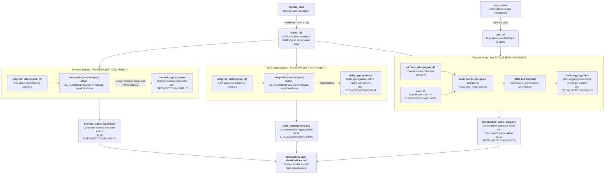

# efa-data-test
This repo contains my Energy Fleet Analyst Data Test Files. I've purposely omitted the input files and specific questions for the test as this is a public repo.

## File Details
 - `analysis.ipynb` - Analysis and answers for questions 1-3 as well as providing the data set for question 4.
 - `Exploratory data visualizations.twb` - Tableau Workbook with visualizations in support of question 4. Available to view on [Tableau Public](https://public.tableau.com/app/profile/daniel.northcott/viz/Exploratorydatavisualizations/AlertsReport).
 - `input_validation.ipynb` - Initial exploration of the energy data.
 - `data_viewer.ipynb` - A data viewer of the input data helpful for checking the analysis results and investigating outliers.
- `helper.py` - Contains some helper functions used throught the Jupyter notebooks to avoid duplicated code.
 - `/energy_data` - Location for the input data to be read from (folder must be provided locally as it is in `.gitignore`).
 - `/analysis_results` - Location for analysis outputs (csv files) generated by `analysis.ipynb` for import to Tableau.
    - `daily_aggregations.csv` - Daily aggregations per SITE/ASSET/COMPONENT containing metrics like min/avg/max for the provided signal data and some custom aggregations like `unused_duration` and `estimated_utilization`.
    - `thermal_signal_issues.csv` - Time and component report showing any time where a 30s rolling average temperature exceeded 105 degC along with the 30s max LM_powerLimit (results from question 1 and 2).
    - `temperature_alerts_data.csv` - Time and component report showing each alert and the most recent signal value for each signal (results from question 3).

## Analysis Flow
<!---
If this doesn't render for you, paste the block into the [Mermaid Live Editor](https://mermaid.live/edit)"
-->

## Practical Considerations
 - **Memory usage** - Pandas dataframes load into memory, and it works fine here grabbing the whole thing. With a larger data set, doing one day at a time is a better option. Also, using Spark dataframes with a cluster would be more practical for any real system as well.
 - **Productionization** - Rather than process many days of data at a time to generate reports, it would be better to continually aggregate and analyze data as it comes in, and have the Tableau reports up to date as well. 
     - Some ideas:
        1. We could always reprocess the whole day(s) for any new data that arrives.
        2. We could work on a schedule (e.g. daily) and determine which data is new, overlapping by a whole day each time (i.e. process two days of data each day, one might be wasteful).
        3. We could change the aggregation output format to do a row per log chunk-day, and then change the way we perform analysis to do group by date and various sum, min, max, mean operations on columns (if reasonable) to get back to daily aggregates if we needed to. Then it would only require inserting one or more fresh aggregation row(s) per processed log chunk.
        4. Some kind of streaming aggregating architecture, so long as data arrives in order (or we can correct it when not, or don't care much if it's rare we could skip old data).
     - For ideas 1-3, the start of the pipeline would need one or more input parameters such as:
        - Define the time range to be processed instead of grabbing all files in a particular folder.
        - Provide a list of references to the new log data files that are ready for processing.